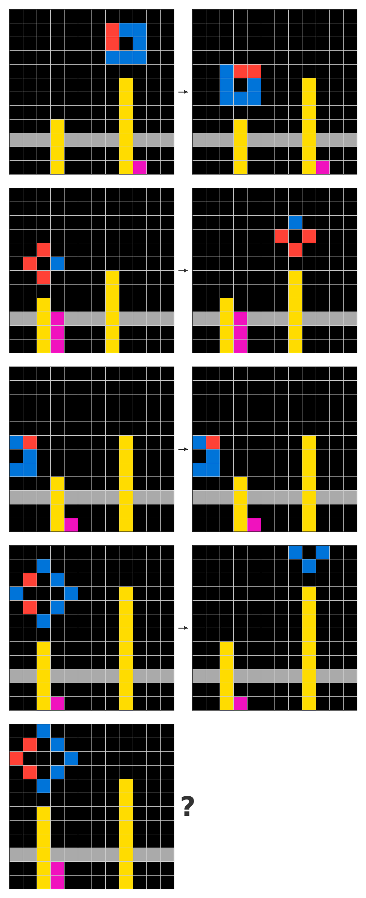
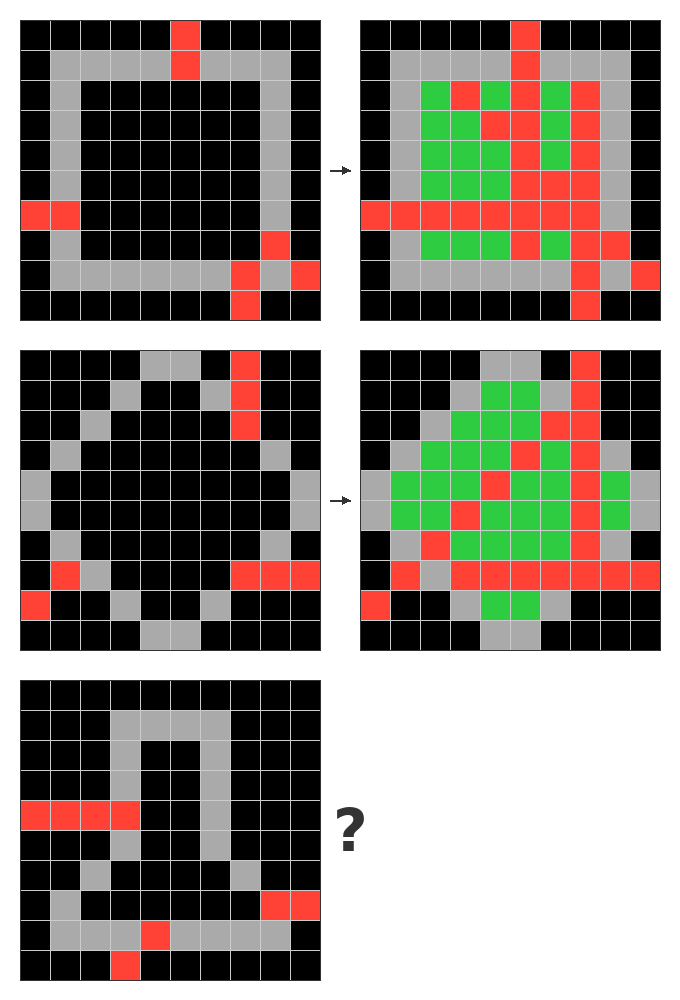

# ARCTIC-0

A public release of the **ARCTIC-0** dataset — a hand-authored benchmark of 85
grid-reasoning tasks in the [ARC](https://arcprize.org/) (Abstraction and
Reasoning Corpus) format, together with the task-authoring tool used to create it
and an analysis notebook for inspecting task metadata.

ARCTIC-0 is built around the **Transfer & Induction Core** (TIC) idea: tasks are
grouped by reasoning *skills* via tags (e.g. `predict`, `intersection`,
`segmentation`, `torus`, `fill`) and by *difficulty* (`easy` / `medium` /
`hard` / `expert`), so models can be evaluated not only on overall accuracy but
on which kinds of abstraction they generalize to.

## Examples

Example tasks from the ARCTIC-0 dataset (input → output):

<p>
  
  &nbsp;&nbsp;
  
</p>

## Repository structure

```
.
├── arc-task-editor.html              # Single-file browser tool to author/edit ARC tasks
├── dataset/
│   ├── arctic-0-85-0.6.2.json        # Full dataset: 85 tasks (train + test examples), tags, descriptions
│   └── arctic-0-85-0.6.2_test.json   # Reference test outputs (answer key) for the 85 tasks
├── png/                              # Sample task visualizations
└── tags_analysis.ipynb               # Notebook analysing tag frequency / difficulty distribution
```

## Dataset

The dataset is distributed as JSON. Each task is a set of input/output grid
pairs using the standard ARC 10-color palette (`0`–`9`).

### Full dataset — `dataset/arctic-0-85-0.6.2.json`

Top-level object:

| Field        | Type     | Description                                            |
|--------------|----------|--------------------------------------------------------|
| `version`    | string   | Export format version (`"1.0"`).                       |
| `exportDate` | string   | ISO-8601 export timestamp.                             |
| `tasks`      | array    | List of 85 task objects (schema below).                |

Each task object:

| Field                | Type    | Description                                                       |
|----------------------|---------|-------------------------------------------------------------------|
| `id`                 | string  | Unique task identifier.                                           |
| `name`               | string  | Human-readable task name.                                         |
| `description`        | string  | Free-form task description.                                       |
| `tags`               | array   | Skill + difficulty labels (e.g. `easy`, `predict`, `torus`).      |
| `examples.train`     | array   | Training pairs with visible `input` and `output` grids.           |
| `examples.test`      | array   | Test pairs (`input` shown, `output` is the target).               |
| `currentTrainExample`| integer | Last-edited train index (editor bookkeeping).                     |
| `currentTestExample` | integer | Last-edited test index (editor bookkeeping).                      |

Each example is `{ "input": [[int,...],...], "output": [[int,...],...] }`, where
every cell is an integer `0`–`9` representing an ARC color.

### Reference outputs — `dataset/arctic-0-85-0.6.2_test.json`

Maps task `id` → reference test outputs, for scoring model predictions:

```json
{
  "<taskId>": {
    "taskName": "Task Name",
    "testOutputs": [
      { "exampleIndex": 0, "output": [[...]] }
    ]
  }
}
```

### Statistics

| Metric                      | Value |
|-----------------------------|-------|
| Tasks                       | 85    |
| Unique tags                 | 88    |
| Training examples (total)   | 211   |
| Test examples (total)       | 85    |
| Avg. training pairs/task    | 2.48  |
| Avg. test pairs/task        | 1.00  |

Difficulty distribution (by tag):

| Difficulty | Tasks |
|------------|-------|
| easy       | 53    |
| medium     | 23    |
| hard       | 7     |
| expert     | 1     |

## Task editor

`arc-task-editor.html` is a dependency-free, single-page tool for creating and
editing ARC tasks in a browser. Just open the file — no build step or server
required.

Features:

- Create tasks with multiple train/test examples (input + output grids).
- Click-and-drag painting with the 10-color ARC palette.
- Arbitrary grid resizing (`WxH`, up to 100×100).
- Copy/paste and input→output duplication.
- Tags, descriptions, and task search.
- Import/export tasks and test outputs as JSON.
- Auto-save to the browser's `localStorage`.

Keyboard shortcuts (press `?` in the app for the full list):

| Shortcut           | Action                                  |
|--------------------|-----------------------------------------|
| `0`–`9`            | Select color from palette               |
| Drag               | Paint cells with the selected color     |
| `Alt` + size       | Resize input and output grids           |
| `Ctrl`/`Cmd` + `Q` | Resize input grid only                  |
| `Ctrl`/`Cmd` + `A` | Resize output grid only                 |
| `Ctrl`/`Cmd` + `D` | Duplicate input → output                |
| `Ctrl`/`Cmd` + `C` | Copy current grid                       |
| `Ctrl`/`Cmd` + `V` | Paste grid                              |
| `?`                | Show keyboard-shortcut help             |

## Analysis notebook

`tags_analysis.ipynb` loads `dataset/arctic-0-85-0.6.2.json` and produces a
summary of tag frequencies and the difficulty distribution (bar charts via
matplotlib/seaborn). It requires Python with `matplotlib`, `pandas`, and
`seaborn`:

```bash
pip install matplotlib pandas seaborn
jupyter notebook tags_analysis.ipynb
```

## Loading the dataset

```python
import json

with open("dataset/arctic-0-85-0.6.2.json") as f:
    data = json.load(f)

for task in data["tasks"]:
    print(task["name"], task["tags"])
    for pair in task["examples"]["train"]:
        inp, out = pair["input"], pair["output"]
        # ...your solver...
```

## License

- **Code** (`arc-task-editor.html`): [MIT License](./LICENSE).
- **Dataset** (`dataset/`): [CC BY 4.0](https://creativecommons.org/licenses/by/4.0/).

By using this dataset you agree to the applicable license terms. If you use
ARCTIC-0 in your work, please cite this repository.

## Citation

```bibtex
@misc{arctic0,
  title  = {ARCTIC: Open Benchmark and Public Runtime for Transfer \& Induction},
  author = {Alex Zhdanov and Artem-Darius Weber and Egor Kolychev and
            Artem Ligostaev and Veronika Rastorgueva and
            Prutskii, Alekseii Sergeevich},
  year   = {2026},
  note   = {Dataset and task editor, version 0.6.2},
  url    = {https://github.com/opensiro/arctic-0}
}
```
